# CityAR

Das Projekt wurde so erweitert, sodass alle Distrikte erstellt werden. Alle grünen Distrikte sind ausschließlich Platzhalter, auf deren Position die Gebäude gebaut werden sollen. In der fertigen Version sollen keine grünen Platzhalter mehr zu sehen sein (z.B: MeshRenderer deaktivieren). Alle Platzhalter für den Bauplatz der Gebäude haben am Ende "Base" im Namen.

Hinweis:
- Das Gruppieren der Gebäude kann über eine GridObjectCollection erfolgen

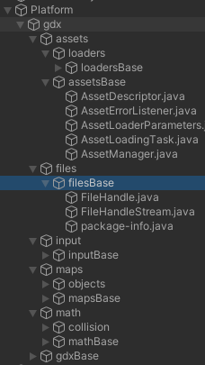
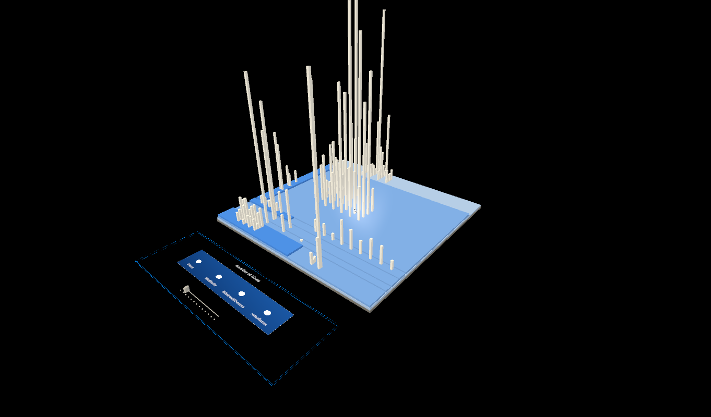
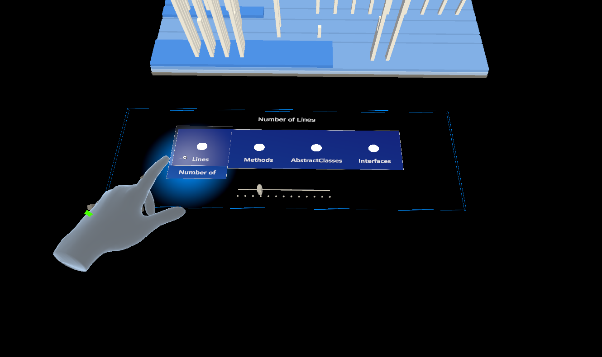
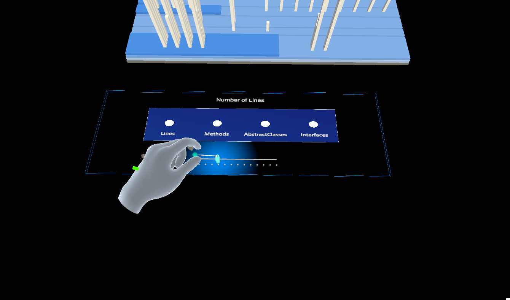
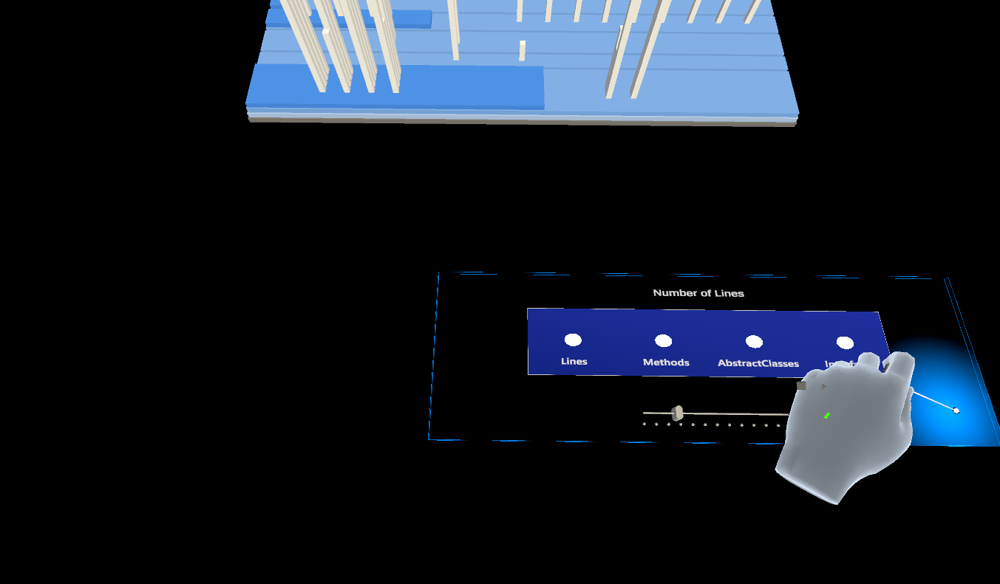
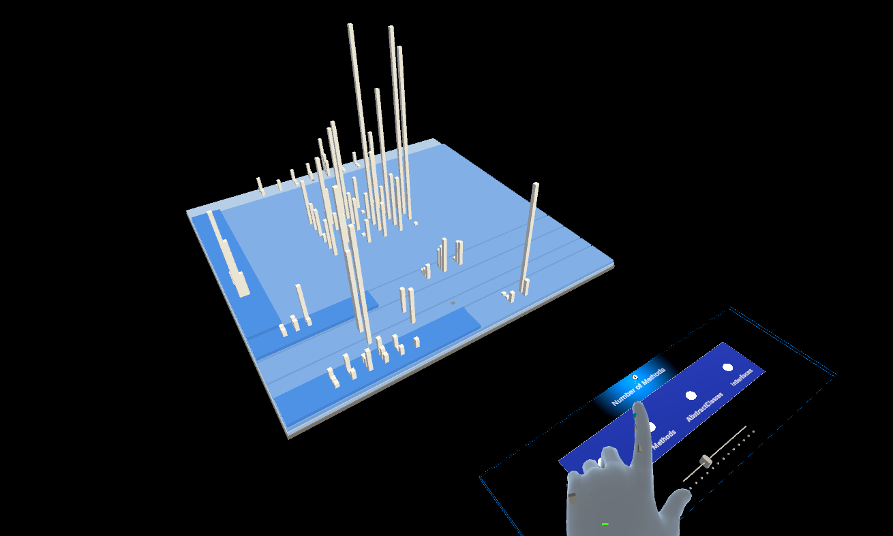
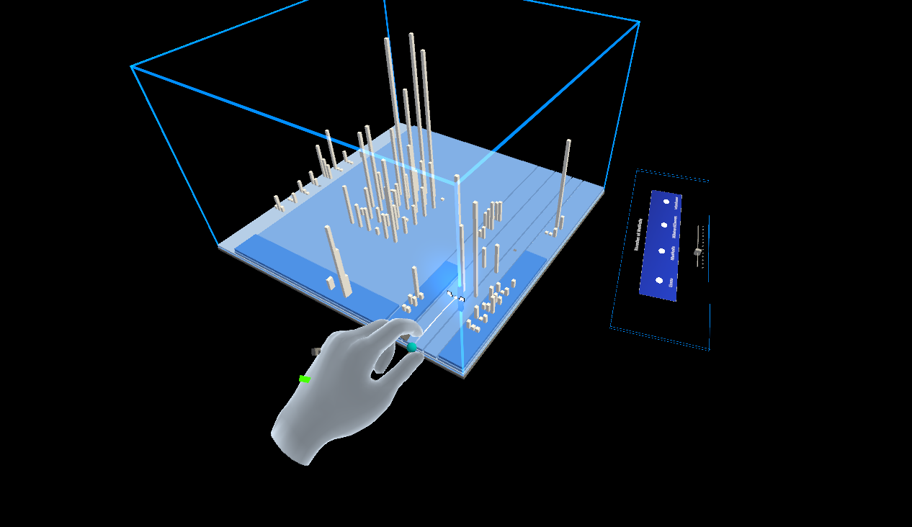
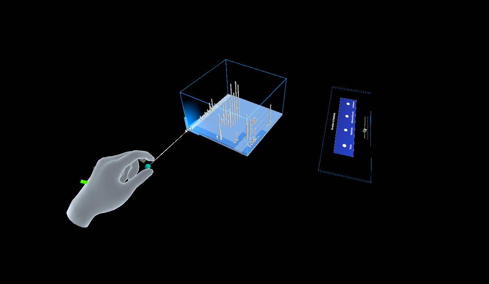
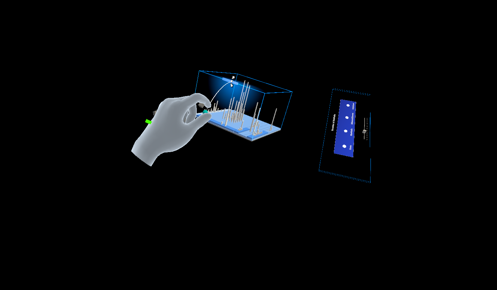
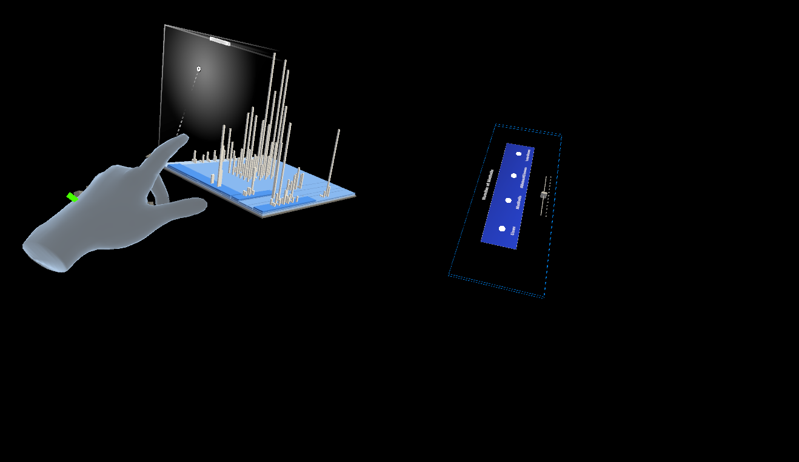
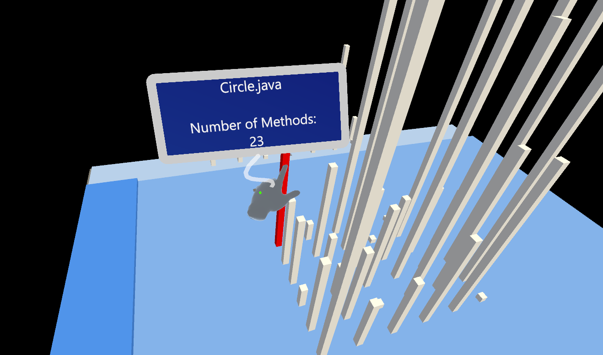
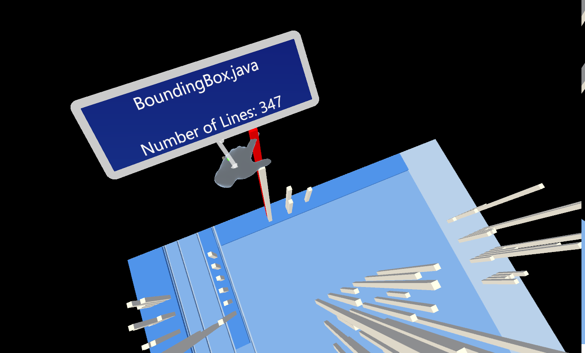
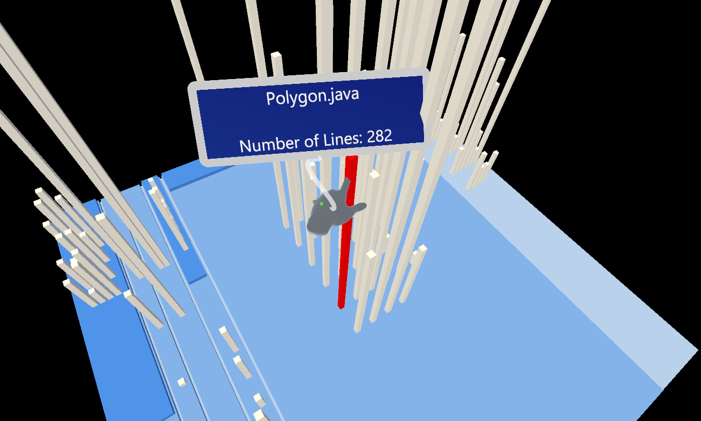
